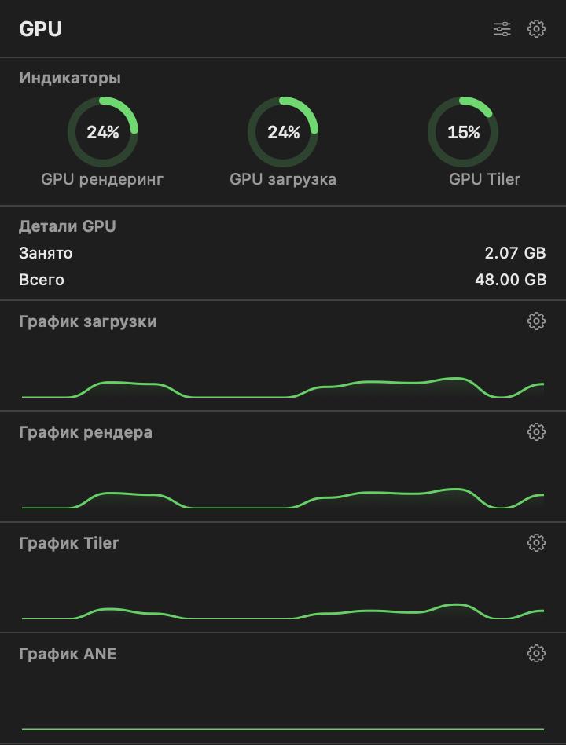
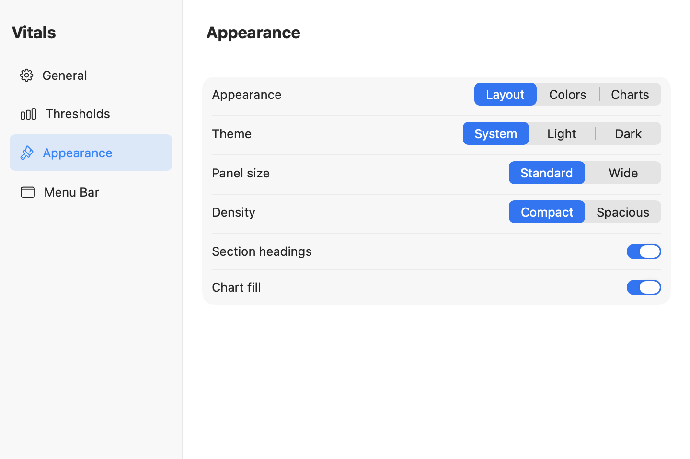

# Vitals

Vitals keeps CPU, GPU and memory usage in your Mac's menu bar. Open a panel
to see recent activity, available temperature readings and the processes using
the most resources. Choose what to display and how often to refresh it.

**English** | [Русский](README.ru.md)

## Screenshots

<p>
  
  
</p>

The screenshots show the app in Russian. You can switch between English,
Russian and German without restarting.

## Features

- See CPU usage and temperature, along with the busiest processes.
- Check GPU activity and memory usage, with additional counters where the driver supports them.
- View used, free and total RAM, and the processes using the most memory.
- Follow recent activity on charts with timestamps, adjustable thresholds and custom colors.
- Set separate refresh intervals for open panels and background monitoring, processes and temperature readings.
- Choose which menu bar items to show, hide or reorder panel sections, and use a compact or spacious layout.
- Use a light or dark theme, or follow your Mac's appearance setting.
- Enable launch at login. Panels close when you switch to another app or desktop.

A short setup window opens on the first launch. You can revisit it from settings.

## Requirements

The app requires **macOS 14.6 or newer** and runs on Intel Macs and Apple Silicon.

To build it, use **Xcode 26.2 or newer**, with Swift 6.2+ and the macOS SDK.
No third-party libraries need to be installed. Although the project uses Swift 5
language mode, it relies on newer compiler features and will not build with Xcode 15.

## Hardware limitations

Available readings depend on your Mac and its drivers. Some models provide more
information than others:

- If a CPU temperature sensor cannot be read, the panel shows `N/A`.
- GPU readings vary between Intel, AMD and Apple drivers. Render, tiler and ANE
  counters are not available on every Mac; unsupported counters may show zero.
- On Apple Silicon, the CPU and GPU share memory. GPU memory readings should not
  be interpreted as the capacity of a separate graphics card.
- macOS permissions can limit which processes are visible. A process using
  several CPU cores can show more than 100% usage.
- The RAM percentage shows memory usage, not macOS memory pressure.

The Universal build covers both architectures, but not every Mac model has been
tested on real hardware. If a reading is missing, please include your Mac model,
processor, GPU and macOS version in the issue.

## Build From Source

```sh
git clone https://github.com/gd182/Vitals.git
cd Vitals
open Vitals.xcodeproj
```

Select the `Vitals` scheme in Xcode and run the app. Look for it in the menu bar,
not the Dock.

To build for both Intel and Apple Silicon from the terminal:

```sh
xcodebuild -project Vitals.xcodeproj -scheme Vitals -configuration Release \
  -destination 'generic/platform=macOS' -derivedDataPath /tmp/VitalsBuild \
  ARCHS='arm64 x86_64' ONLY_ACTIVE_ARCH=NO CODE_SIGNING_ALLOWED=NO build
lipo -archs /tmp/VitalsBuild/Build/Products/Release/Vitals.app/Contents/MacOS/Vitals
```

The app will be at `/tmp/VitalsBuild/Build/Products/Release/Vitals.app`.
This build is unsigned and intended for development. Preparing a public release
also requires signing and notarization.

## Tests

```sh
bash Tests/run-checks.sh
```

To also check panels and settings windows and capture screenshots, run this
from an active macOS desktop session:

```sh
bash Tests/run-checks.sh --ui
```

The [test documentation](Tests/README.md) explains what is covered and what still
needs a manual check. Local checks have passed with Xcode 27; GitHub Actions is
configured to use Xcode 26.2, build both architectures and run tests without a GUI.
Hardware readings and desktop interactions still need to be checked on a real Mac.

For manual CPU load testing, `test/load.py` can keep all cores busy until you
stop it with Ctrl+C. It requires Python 3 and is never started by the app or CI.

## Under the Hood

<p>
  
  
</p>

The interface is built with SwiftUI. C++20 collects system metrics, and an
Objective-C++ bridge connects it to Swift. Temperature readings use Swift SMC helpers.

- `Vitals/Core/`: Mach/sysctl/libproc/IOKit collectors plus Swift SMC helpers.
- `Vitals/Bridge/`: Objective-C++ interface to the native collectors.
- `Vitals/ViewModels/`: background updates and recent chart history.
- `Vitals/Views/`: menu items, panels, settings and charts.

Vitals reads system data locally, without launching `ps` to list processes.
Settings are saved in UserDefaults. Chart history has a fixed size and stays in
memory rather than being continuously written to disk.

## Contributing and Releases

Found a bug or have an idea? Start with the [contribution guide](CONTRIBUTING.md).
The [release checklist](docs/RELEASING.md) covers preparing a build for distribution.
Before sharing logs or screenshots, remove credentials, certificates, serial
numbers and private process details that are not needed to explain the issue.

## License

MIT - see [LICENSE](LICENSE).
